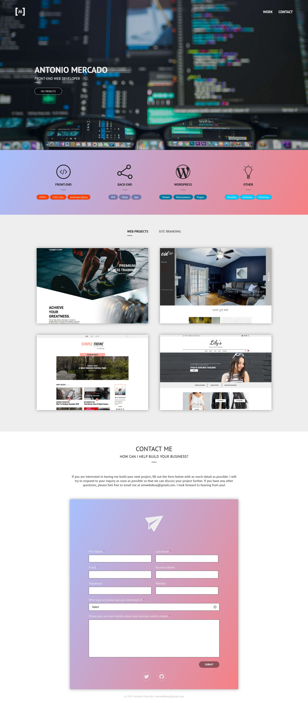

This portfolio was developed using [_React_](https://reactjs.org/) and the [_Gatsby_](https://www.gatsbyjs.com/) framework. Styling is done with the help of the [_Tailwind CSS_](https://tailwindcss.com/) framework. And for most of the animations, the [_Framer Motion_](https://www.framer.com/motion/) React library is used. The source code for this project can be found [here]().

 

My previous web portfolio was made years ago when I was still fresh into learning front-end related development. As I started learning about other various technologies, I felt the site I made should no longer serve as the representation for myself as a developer.

<figure>

<small>First portfolio attempt, circa 2019.</small>

</figure>

The design of my new site is intended to serve as a simple beginner/junior level front-end web developer portfolio; with some simple blog capabilities as well&mdash;of which I'd like to expand in the future.

I'll continue to extend the features of my site as I go along, or more than likely create something entirely new as I continue to learn more about web development.
