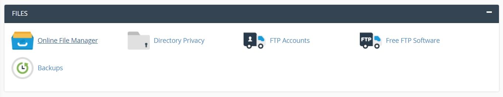
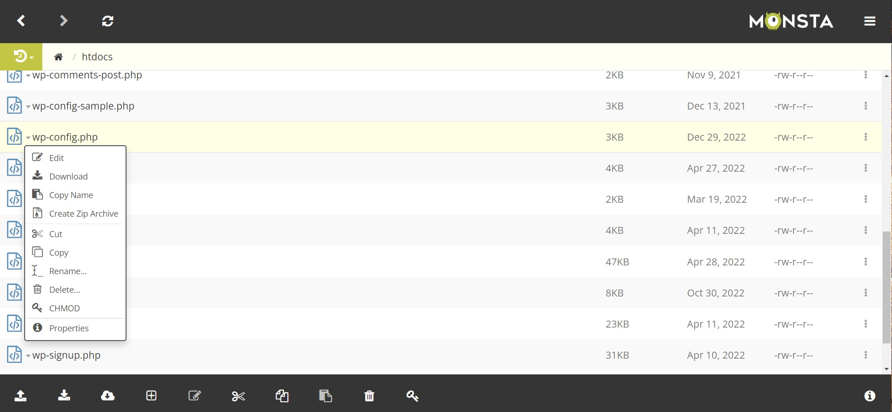
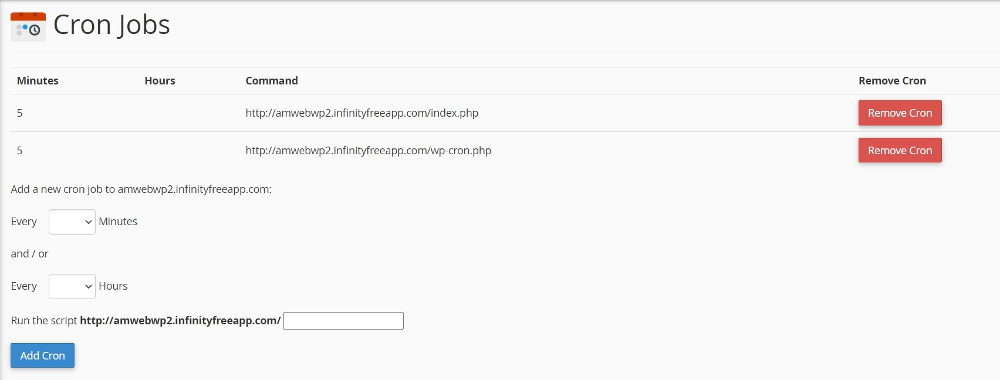

This tutorial is in reference to a thread on the InfinityFree forums. The original post can be found [here](https://forum.infinityfree.net/t/website-load-times-very-slow/56663).

 

I have a couple of WordPress sites hosted on [InfinityFree](https://www.infinityfree.net/) that take forever to load after they've been idle for some time. Since these projects are for portfolio purposes, I really don't want potential visitors to wait 30&#8211;60 seconds before the page becomes presented to them.

The drawn-out loading happens initially due to the server moving content into a web cache before properly displaying the page. This is all well and good once completed, but when the site becomes idle again, the cache is removed until the site is revisited&mdash;where the cycle of the minute-long wait time begins again. On non-premium hosting providers this can become more of an issue, especially in situations where a bulky WordPress installation&mdash;in my case a simple [blog](https://amwebwp.infinityfreeapp.com/?i=1), and one that uses [WooCommerce](https://amwebwp2.infinityfreeapp.com/?i=1)&mdash;can make the web caching loading time far far worse.

Recently I read about a potential solution that would speed load times for end-users. This would involve, according to [this](https://forum.infinityfree.net/t/website-load-times-very-slow/56663) forum thread, the creation of system "cron" jobs within the cPanel software used by your InfinityFree web host (accessed from the main dashboard).

If you are unfamiliar with the term, a cron job is something you'd create within a Unix-based system's command-line to schedule certain tasks; These tasks are set to be performed at fixed times or on a schedule. In Windows this similar functionality is achieved through the _Windows Task Scheduler_ system application.

To do this we will set up two cron jobs: one that calls the `index.php` script, and another that calls `wp-config.php`. By calling these scripts in a timed interval (5 minutes) using a cron, it will continually refresh the resource on the server. The result of this will speed up (or bypass) initial load times by not allowing the server to throw out its cache after a certain amount of idle time has passed.

The first step in this process is to access your cPanel. Once there, the two options you should look for are the **_Online File Manager_** under "FILES", and **_Cron Jobs_** near the bottom under "ADVANCED".

<figure>

<small>File manager in cPanel.</small>

</figure>

<figure>

<small>Cron jobs in cPanel.</small>

</figure>

Before we start adding any crons, it is important that we disable the WordPress built-in cron handler: [**WP-Cron**](https://developer.wordpress.org/plugins/cron/#why-use-wp-cron).

WP-Cron works similar to a system cron, except that the scheduled tasks are related to WordPress core and plugin functionality&mdash;checking for updates, creating backups, having set times to publish posts, etc. This also differs from a system cron because, according to the official documentation, ["WP-Cron does not run constantly as the system cron does; it is only triggered on page load."](https://developer.wordpress.org/plugins/cron/#why-use-wp-cron) The fact that this process is triggered on page load is the reason why it will be disabled in favor of having system cron jobs regularly call the WP-Cron script instead.

We will do this by using the file manager (from cPanel) to access your web files and find your WordPress installation within the "**htdocs**" folder. Here you will find the `wp-config.php` file. Click on the file and select edit. This will allow you to use the browser-based editor in order to add the line `define('DISABLE_WP_CRON', true);` anywhere within the file.

Once you are done, save and close the editor, and go back into cPanel.

<figure>

<small>Selecting wp-config.php within the browser file manager.</small>

</figure>

All that's left is to add the two system cron jobs.

Start by selecting the "**Cron Jobs**" option mentioned earlier. Choose the correct domain from the drop-down and select "**Alter Crons**". From here you will create two cron jobs that will run every 5 minutes, which is what we need in order to keep the server from dumping the web cache. Enter the amount of time in minutes or hours (in our case 5 minutes), and enter "**index.php**" into the field next to the URL of your domain. Once that's done simply click "**Add Cron**" to add the cron command to your list of cron jobs (you can also remove it now if you wish to do so). Do the same for the other script with the same interval of 5 minutes: "**wp-cron.php**".

<figure>

<small>Successfully added cron jobs.</small>

</figure>

Now you should notice the initial loading of your WP site appears be a lot faster than it was before. If you are in a similar situation like me, and just want to quickly be able to host some projects to use within your portfolio, I hope this little post was of some help.

If you're still having trouble with your WordPress site and/or are expecting to have a lot of visitor traffic, you may want to look into [further ways](https://www.dreamhost.com/blog/optimize-wordpress-website-speed/) that will help to increase the performance of your site, which most likely involves premium hosting options.
