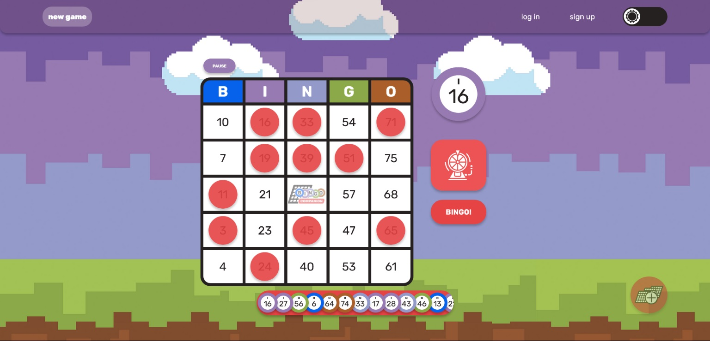
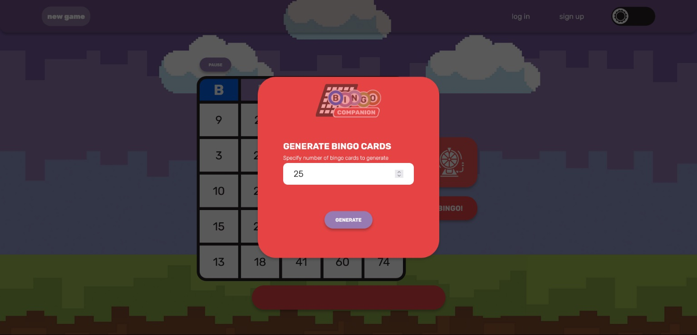
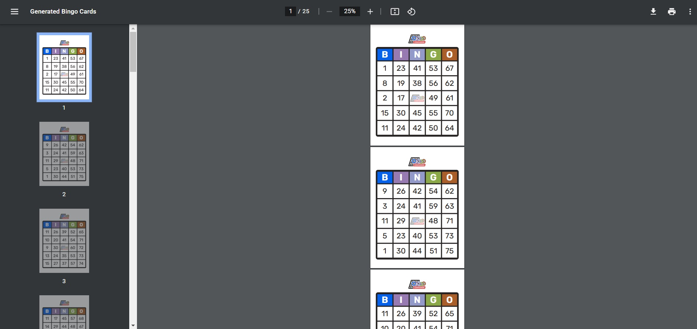
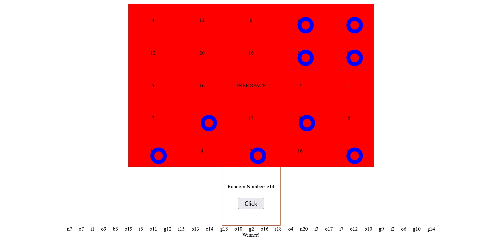
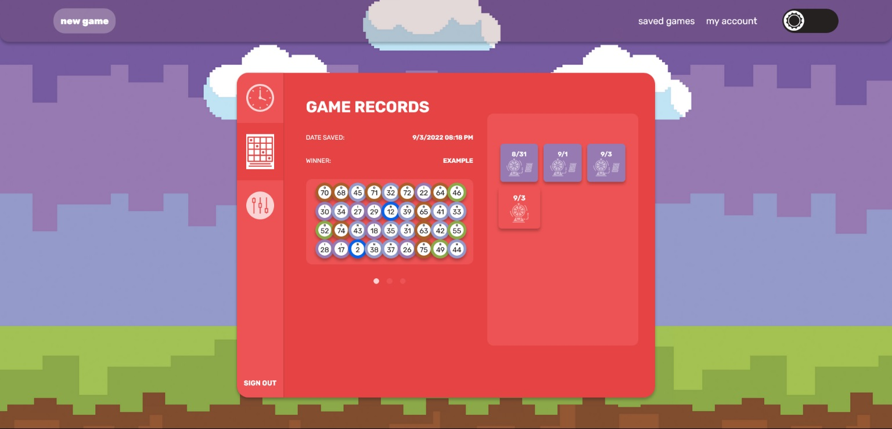

This post is a quick summary about my React project, _Bingo Companion_. You can check it out on GitHub [here](https://github.com/antmercado94/bingocompanionapp), or view it in action [here](https://bingocompanionapp.netlify.app/).

<br/>
<figure>


<p align="center"><small>App logo (graphic design is my passion, obviously).</small></p>
</figure>

> _**A simplistic way to play or host a bingo game...**_

This was the first project I made after learning [React](https://reactjs.org/). I wanted to be able to create a web app that would make use of the framework's core features: states, contexts, hooks, reducers, etc.

The idea for the app itself was to develop something that would make for a good beginner React portfolio project. I started out thinking of those memory matching games&mdash;where you keep matching two of a kind until you find all the matches on a grid. This would have been great, but I also figured it'd be better to make something with a little more utility; Eventually I somehow decided to make a web-based, Bingo app thing.

<figure>



<p align="center"><small>Bingo web game app thing.</small></p>
</figure>

With this new idea in mind I started to think about other possible features. I thought it would be a neat idea if users could generate their own bingo-style cards. In this way, the app can be used as a potential replacement for the physical items needed to play a game of bingo with a group of people.

<figure>



<p align="center"><small>Generating 25 Bingo Cards.</small></p>
</figure>

To achieve this, I set up a [REST API](https://github.com/antmercado94/bingocompanionapp-api) route on the backend of my app which uses [Node.js](https://nodejs.org/en/about/). When a user sends a POST request to this route containing the amount of cards they wish to generate, a PDF file is generated containing the requested amount of printable bingo cards. Each card is randomized in a way that adheres to what is considered the ["traditional BINGO"](https://www.iitk.ac.in/esc101/05Aug/tutorial/together/bingo/traditional.html) 75-Ball layout and pattern.

This whole process is done with the help of the [**_pdfmake_**](http://pdfmake.org/#/) package; as well as the [**_html-to-pdfmake_**](https://www.npmjs.com/package/html-to-pdfmake) package&mdash;making the use of HTML templates possible when creating PDFs.

<figure>



<p align="center"><small>Generated cards in a PDF file.</small></p>
</figure>

Before I started the development process I needed to be sure if I had learned enough JavaScript and React in order to actually follow through my potential idea. To build some confidence I started out by creating a simple test project that would act as a sort of prototype.

<figure>



<p align="center"><small>Prototype for matching row/column/diagonal of 5</small></p>
</figure>

In this prototype, I use React hooks for all the main functionality related to setting or matching rows or columns. Whenever a random letter&mdash;in the form of b, i, n, g, or o, of course&mdash;and number combination is chosen with the "call" button, a useEffect hook is used to loop through all the numbers that make up the bingo grid ("cellGrid" state).

When a match is found between a called column/number and a grid column/number, a boolean is set from "false" to "true" for that particular cell within the state. A marker is then placed on the cell visually using a CSS class named "match" that is provided whenever a cell's "match" bool value is true.

The result here is what went on the be the basis for the development of the app.

```javascript
import { useContext, useEffect, useState } from "react";
import { NumbersContext } from "../contexts/NumbersContext";

const BingoGrid = () => {
  const { numbers, setMatching, columns } = useContext(NumbersContext);
  const [cellGrid, setCellGrid] = useState([]);
  const matchingCells = [];

  /* fetch data to populate cell grid */
  useEffect(() => {
    fetch("/api/cells")
      .then(res => {
        return res.json();
      })
      .then(data => setCellGrid(data.cells));
  }, []);

  /* check each cell val for matching num within 'numbers' state */
  useEffect(() => {
    numbers.length &&
      cellGrid.forEach((cell, index) => {
        for (let i = 0; i < numbers.length; i++) {
          const numberCol = numbers[i][0];
          const numberVal = numbers[i][1];
          if (numberCol === cell.column && numberVal === cell.value) {
            console.log(`MATCHED ${cell.value}`);
            matchingCells.push({
              column: columns[cell.column],
              value: cell.value,
              index: index,
              startingX: [0, 5, 10, 15, 20].includes(index) ? true : false,
              startingY: [0, 1, 2, 3, 4].includes(index) ? true : false,
              startingD: [0, 4].includes(index) ? true : false,
            });
            cell.match = true;
          }
        }
      });
    /* set matching vals in ascending order to 
    match 'cellGrid' index alignment */
    matchingCells.length > 0 &&
      setMatching(matchingCells.sort((a, b) => a.index - b.index));
  }, [numbers]);

  return (
    <div className="bingo-grid">
      {cellGrid.map((cell, index) => (
        <div className={`cell ${cell.match && "match"}`} key={index}>
          <div value={columns[cell.column]} className={`cell-${index + 1}`}>
            {cell.value}
          </div>
        </div>
      ))}
    </div>
  );
};

export default BingoGrid;
```

Finally, the app uses [MongoDB Atlas](https://www.mongodb.com/atlas/database), a cloud-based database, which allow user's to save or access various information regarding their account: such as games played or any saved records they have chosen to save after a game has been completed. This can be accessed after a user has created an account or have successfully logged in. User's are also able change their name or email, request a password reset email, or reset/delete their account entirely.

<figure>



<p align="center"><small>Viewing the "game records" panel.</small></p>
</figure>

If you would like to read about some more features regarding the finished version of the app, please view the ["README"](https://github.com/antmercado94/bingocompanionapp#readme) section on the repo where there are some more details about this project.
